# 旅行预订管理系统

基于MySQL，设计并实现的一个简单的旅行预订系统。该系统涉及的信息有航班、大巴班车、宾馆房间和客户数据等信息。

## 应用系统基本功能

1. 数据 **入库** 和 **更新** 功能

   *航班* ，*酒店房间* ，*大巴车* 和 *客户信息* 基础数据的入库和更新

2. **预订** 功能

   预定 *航班* ，*大巴车* ，*宾馆房间*

3. **查询** 功能

   查询 *航班* ，*大巴车* ，*宾馆房间* ，*客户信息* 和 *预订信息*

4. **线路查询** 相关功能

   查询某个客户的 **旅行线路**；检查预定线路的 **完整性**

## 项目介绍

该应用系统使用Java编写，使用Maven管理项目，并实现了GUI界面。GUI界面使用Swing搭建，开发过程配合使用了IDEA GUI Form工具完成GUI界面的设计。

项目实现了一个简单的旅行预订管理系统，数据存储于MySQL数据库中，通过JAVA JDBC访问数据库，使用了阿里巴巴的Druid管理数据库连接。

系统基本功能全部实现，可以在此基础上拓展和丰富新的功能。

## 项目结构

### 项目文件结构

- `/src` 路径下为项目相关代码
  - `/src/main/java` 路径下为项目的源码
    - `/src/main/java/backend` 为项目后端代码
    - `/src/main/java/frontend` 为项目前端（GUI）代码
  - `/src/main/resources` 路径下为项目的资源
  - `/src/test` 路径下为项目的测试代码

- `/out` 路径下放置项目构建后打包的jar包

- `/exe` 路径下放置项目可执行程序

- `/sql` 路径下放置项目中数据库相关操作的sql文件

- `/lib` 路径下存放项目使用的依赖库

- `/ico` 路径下存放项目中的图标

- `/img ` 路径下存放图片

### 代码层次结构

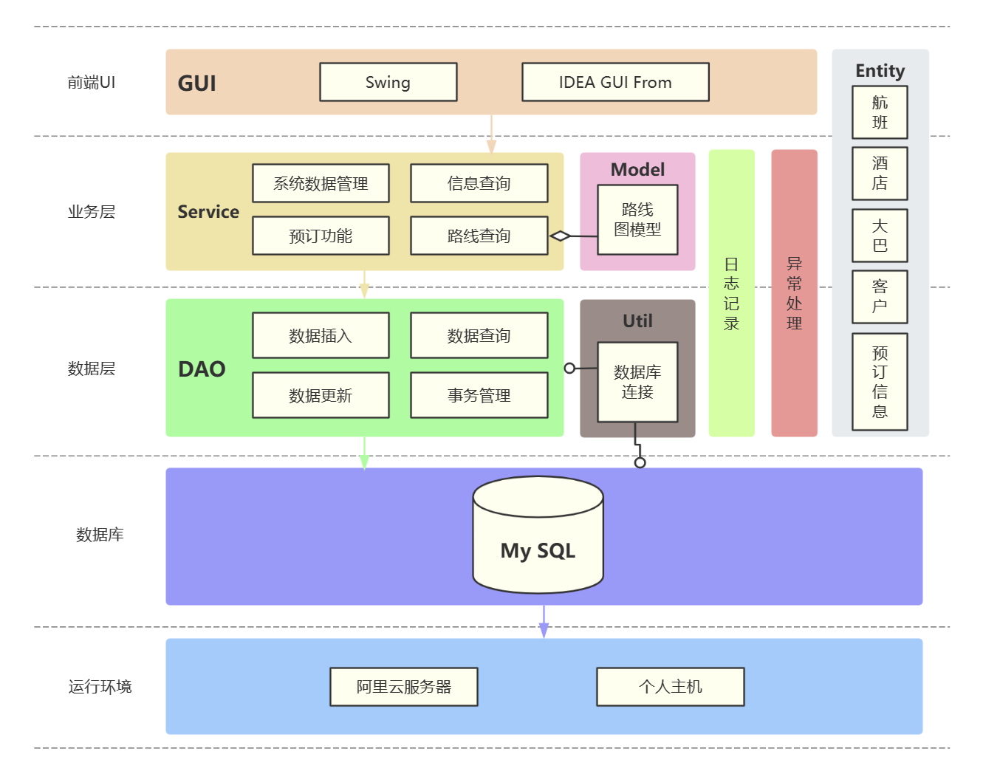

## 项目说明

### 启动方式

**方式一：** 可执行程序（.exe）启动项目

项目的 `/exe` 路径下放置了项目的可执行程序 `Travel System.exe`，双击可直接运行。

> `/exe/jre` 为jre路径，若电脑没有安装java，则这个包必须存在于这个路径下，
>
> `/exe/log` 为项目运行产生的运行日志存放的位置

**方式二：** Jar包启动项目

项目的 `/out/artifacts/TravelReservationSystem_jar` 路径下放置了jar包 `TravelReservationSystem.jar`，执行下列命令可执行jar包来运行程序：

``` shell
java -jar .\TravelReservationSystem.jar
```

这要求系统中已经安装并配置 JAVA，且版本在 **1.8** 以上。

**方式三：** 编译源码启动项目

由于项目GUI界面使用了IDEA GUI Form工具，建议使用Intellij IDEA运行项目。

构建项目时选择Java Maven项目，Maven配置已经放于 `pom.xml` 文件中。主要使用了 `druid`、`mysql-connector-java`、`slf4j`、`lombok` 等依赖。

启动类位于 `/src/main/java` 路径下，在完成项目环境配置于依赖安装后，运行启动类 `Main.java` 启动项目。

### 运行说明

#### 数据库连接说明

本项目连接的MySQL数据库在阿里云服务器上，已知该服务器公网IP地址即可连接，该服务器已经开放3306端口。

本项目使用的阿里巴巴的druid管理数据库连接，若需 **设置或更改数据库连接**，需要在 `/src/main/resources/druid.properties` 配置文件内配置：

- `url` 设置为数据库链接，例如：

  通过JDBC连接本地MySQL数据库中的 `travel_reservation` 数据库，则url为`jdbc:mysql://localhost:3306/travel_reservation`

- 设置用户名 `username` 和密码 `password` 为代连接数据库的用户和其对应的密码，这里需要注意用户权限。

>  直接启动项目即可连接到我设置的服务器的数据库，若需更改得在配置文件中修改并编译源码

#### 程序使用说明

##### 0 主页

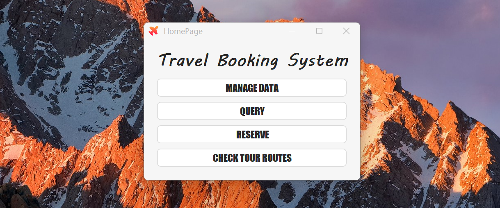

四个按键分别对应四类功能：数据入库和更新功能、查询功能、预订功能和查询旅游路线功能

##### 1 数据入库与更新

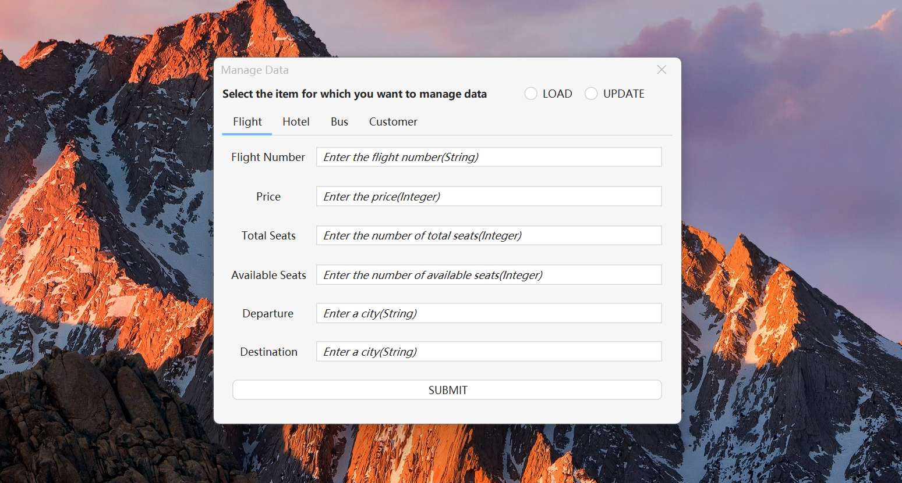

**必选项**（窗口右上角）：

- `LOAD` 入库数据
- `UPDATE` 更新数据

无论入库数据还是更新数据都应该 **填入所有信息**。若有信息未填写，会报错；若未按提示输入对应类型数据，也会报错，或导致数据类型问题。

##### 2 查询功能

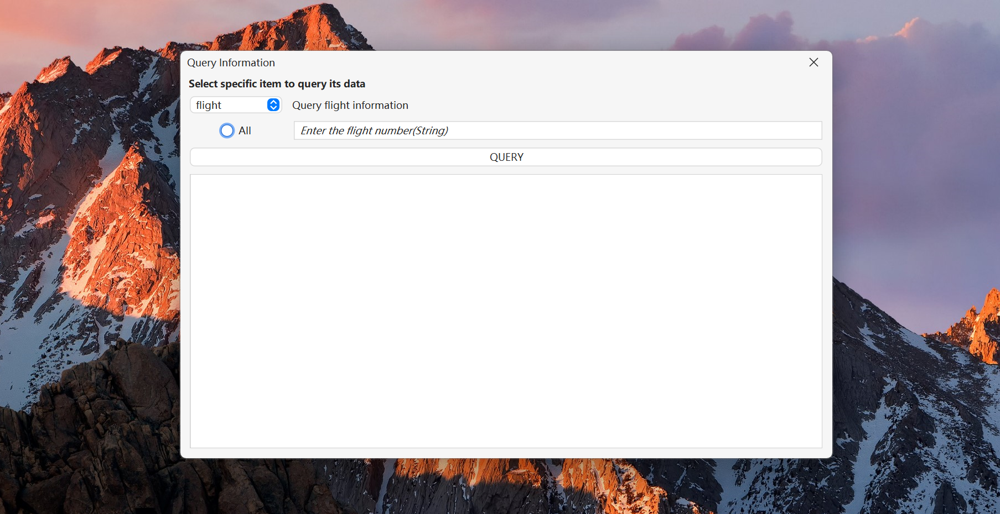

**必选项**（窗口左上角下拉框）：

必须选择查询的对象，提供6个对象可选择：

- 航班信息
- 酒店信息
- 大巴信息
- 客户信息
- 预定信息
- 详细预定信息

**查询模式选择**：

- 不选择 `All` ，则按主键查询，需要在右边输入框内按提示输入主键来查询相应信息
- 选择 `All` ，则查询全部信息，不需要再输入框内输入主键，且此时输入框变为不可输入状态

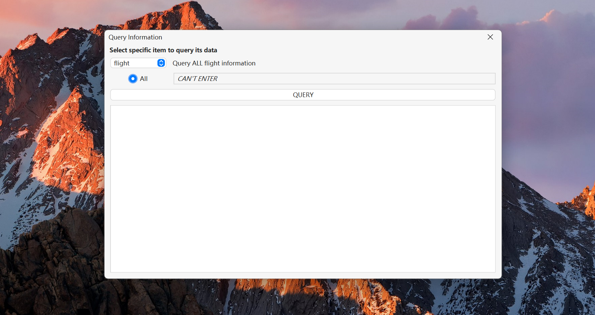

##### 3 预订功能

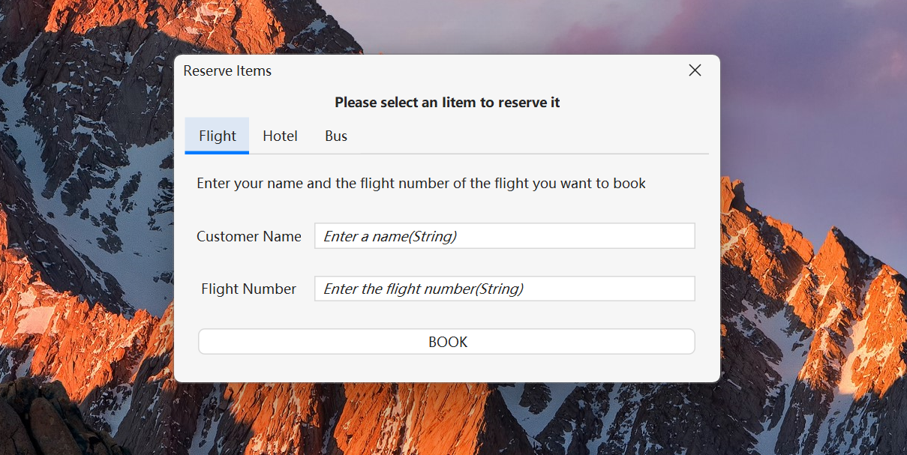

可对航班、酒店、大巴进行预订，需要输入且必须都键入：

- 客户名
- 主键（航班号 / 地区）

##### 4 查询旅游线路功能

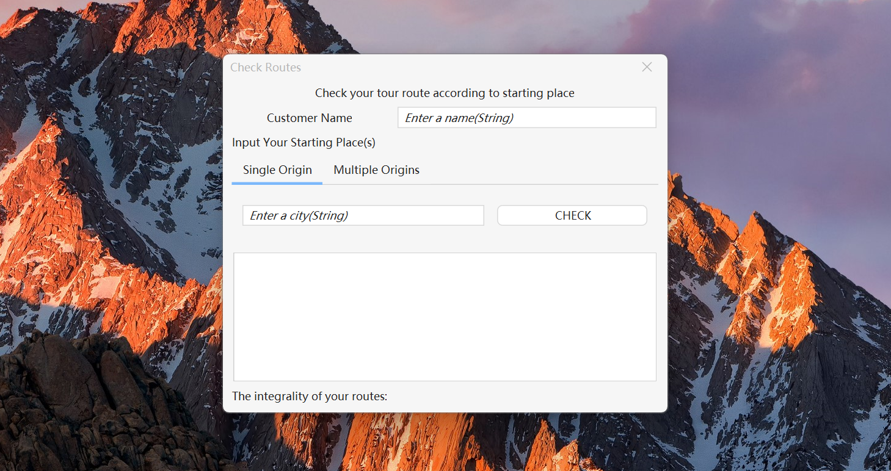

查询路线的 **必要输入**：

- 用户名

- 起点

  起点可以是单一起点也可以是多起点。若选择多起点，则在输入框内，一行输入一个起点。

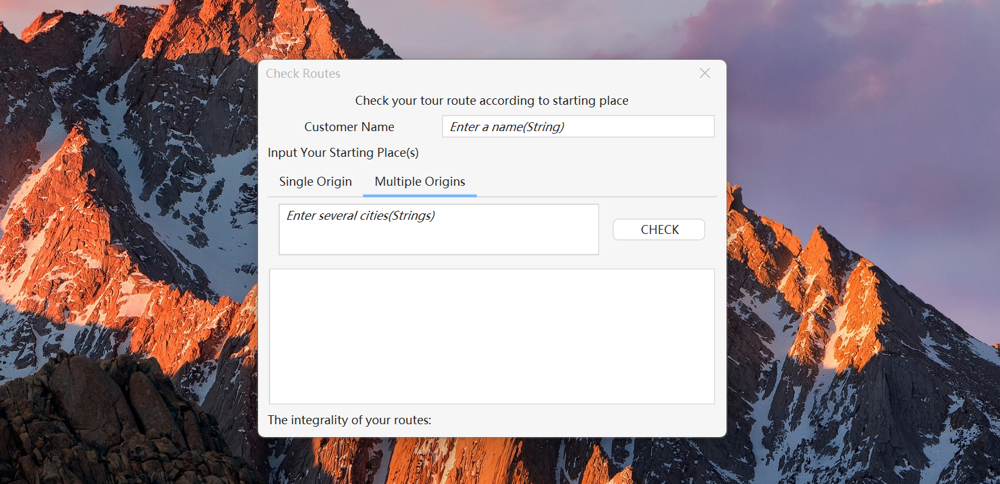

输入后进行查询，即可获得该用户从起点开始的所有 **最长完整路线** 和 **检查预订路线完整性** 的结果

- 最长完整路线：从所有起点开始，包含所有能到达的地方的所有路线，即不会有其他路线是该路线的超集，且提取出的所有路线也不会有包含关系或者相同的情况。
- 路线完整性：从所有起点开始，按用户预订的路线遍历，若能到达所有预订的酒店或大巴的地点以及能乘坐所有的预订的航班，则路线完整，否则不完整。

路线查询功能可以接受任意情况的路线，包括不限于特殊情况：路线汇聚、路线分叉、环状路线等，他们的查询结果都遵循上述规范。

路线查询相关测试见[附录](## 附录)

## 附录

### 路线查询测试

#### 普通路线：连续到达多地

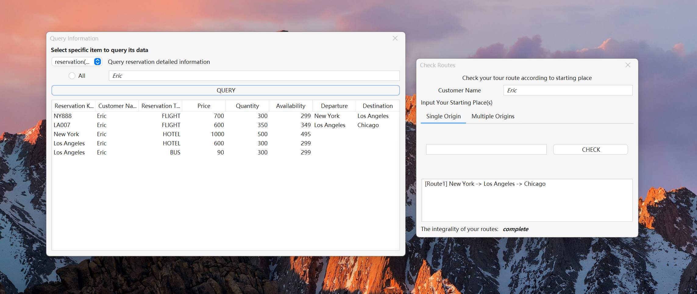

单一起点：New York

#### 分叉路线：倒Y型路线

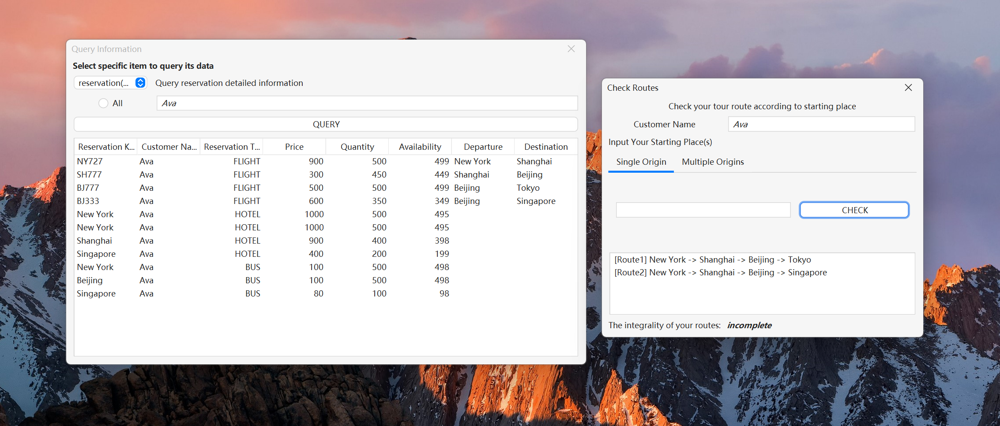

单一起点：New York

#### 汇合路线：Y型路线

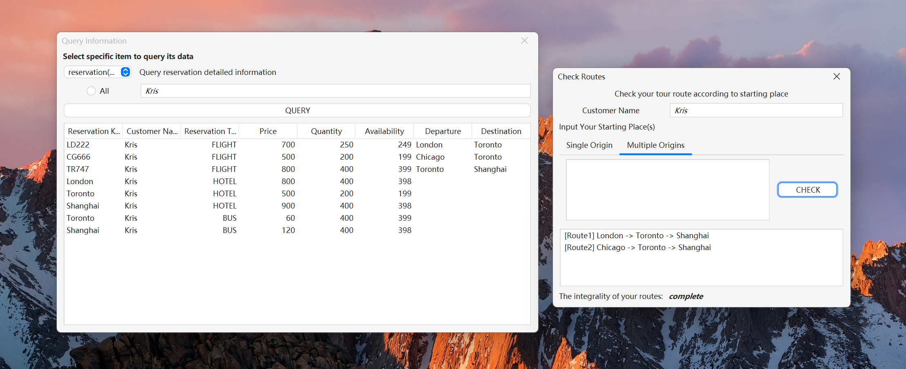

多起点：London 和 Chicago

> 若这里选择单一起点，只会显示那个起点的路线（这里仅一条），并且路线完整性为不完整的，因为总有航班、大巴或酒店无法到达

#### 环形路线

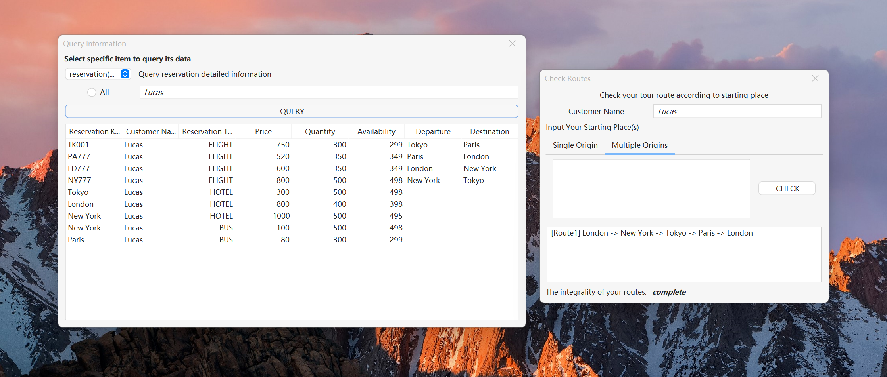

多起点：London 和 New York

> 由于多起点的路线重合，所以只显示一条路线

#### 环形+分支路线：‘6’ 型路线

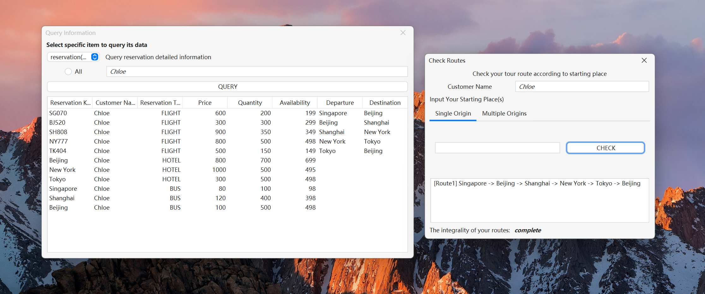

单一起点：Singapore

#### 不连贯路线：酒店/大巴不可达

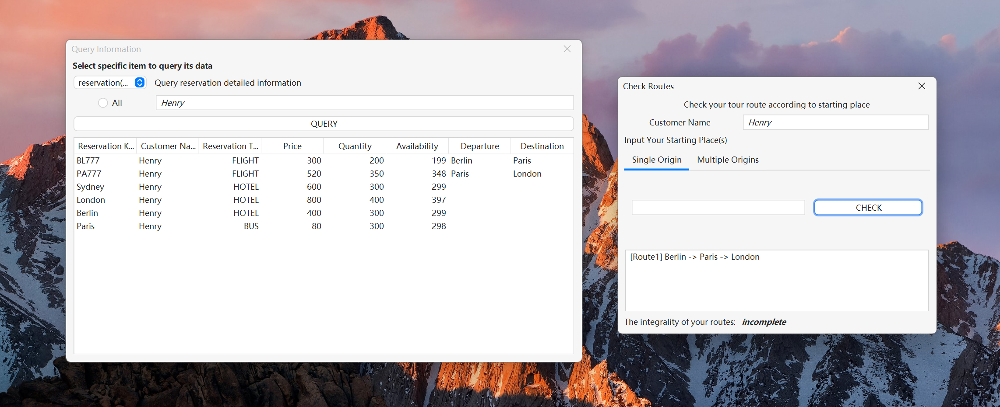

单一起点：Berlin

> 由于Sydney的酒店无法到达，路线判定为不完整